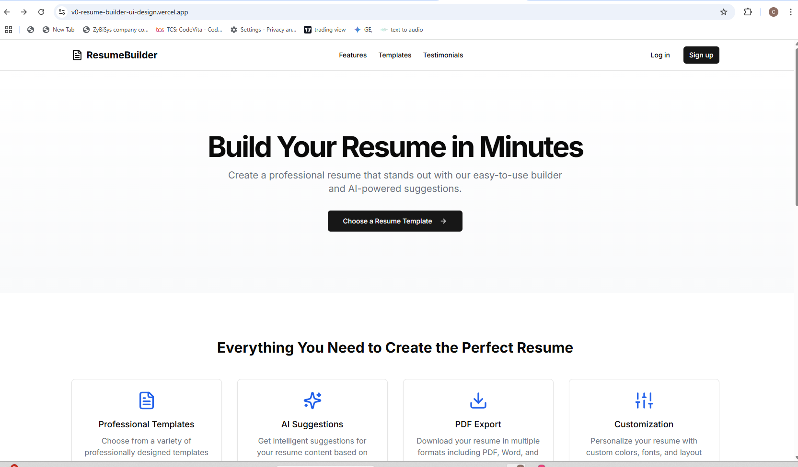
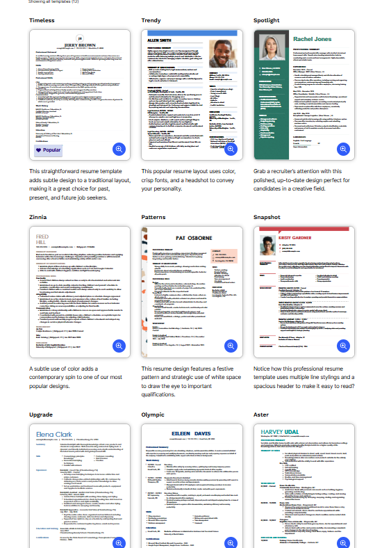
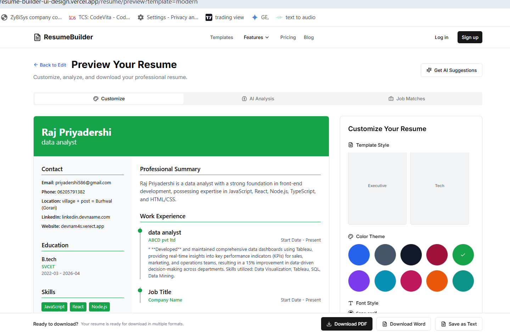
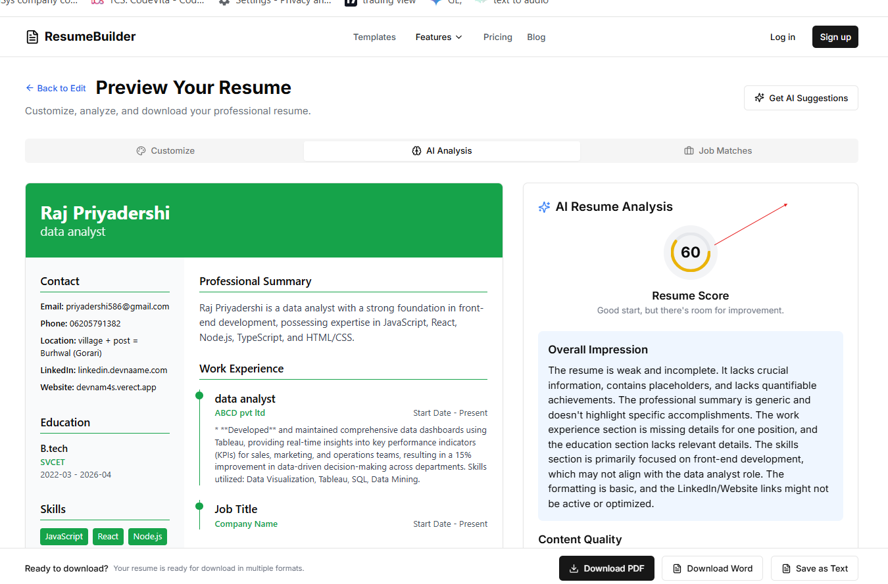
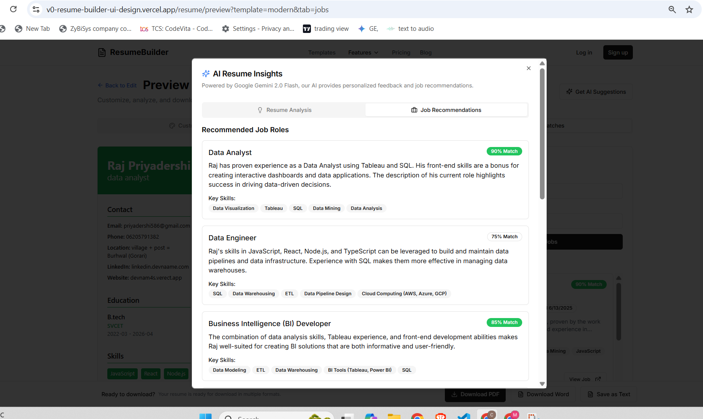

<div align="center">
  <h1>Resume Builder: Your AI-Powered Resume Creator</h1>
  <p>Craft professional resumes and get intelligent insights for your job search.</p>

  <p>
    <a href="https://github.com/Devnaam/Resume-Builder-/graphs/contributors">
      
    </a>
    <a href="https://github.com/Devnaam/Resume-Builder-/stargazers">
      
    </a>
    <a href="https://github.com/Devnaam/Resume-Builder-/issues">
      
    </a>
  </p>

  <p>
    <a href="https://v0-resume-builder-ui-design.vercel.app/" target="_blank">
      
    </a>
    <a href="https://github.com/Devnaam/Resume-Builder-.git" target="_blank">
      
    </a>
  </p>
</div>

---

## 🚀 About the Project

**Resume Builder** is a smart, AI-powered web application designed to help users craft professional, eye-catching resumes with ease. Whether you're a student, job-seeker, or working professional, Resume Builder provides the tools to present your skills and experience effectively and discover suitable job opportunities.

It combines a modern resume builder with AI-powered analysis to provide suggestions, insights, and automation, all in a beautiful, responsive interface.

---

## ✨ Key Features

Resume Builder is packed with powerful modules to guide you in creating your perfect resume:

* 📄 **Resume Builder:**
    * **Intuitive Form-Based Input:** Easily enter your personal details, work experience, education, skills, and more through a user-friendly form.
    * **Diverse Templates:** Select from multiple beautifully designed, industry-specific templates (creative, technical, minimalist, corporate).
    * **AI-Powered Suggestions:** Leverage Gemini AI for auto-generating summaries, suggesting bullet points for experience, and recommending skills.
    * **Customization:** Choose color schemes, fonts, toggle layout blocks, and switch between light/dark mode.
    * **Export Options:** Download your resume as PDF, Word, or Plain Text with real-time preview.

* 🔬 **AI Analysis & Job Matching:**
    * **Resume Analysis:** Get professional improvement suggestions for your resume powered by Gemini AI, including a review and score.
    * **Tailored Job Matches:** Receive relevant job recommendations based on your resume content and analysis.

* 🔧 **Additional Features:**
    * 🌓 **Dark/Light Mode:** Seamlessly switch themes for a personalized experience.
    * 📱 **Fully Responsive Design:** Optimized for all devices, with a mobile-first approach.
    * 💡 **Real-time Validation:** Get instant feedback and assistance while filling forms.
    * 📚 **Guided Onboarding:** (Coming soon) A smooth introduction for new users.

---

## 💻 Tech Stack

Resume Builder is built with a modern and robust set of technologies:

| Layer       | Technology                                                                                                                                                                                                                                                                                                                                                                                                                                                                                                                                                                                                                                                                                                                                                                                                                                                                                  |
| :------------ | :---------------------------------------------------------------------------------------------------------------------------------------------------------------------------------------------------------------------------------------------------------- |
| **Frontend** |           |
| **State Mgmt** |                                                                                                                                                  |
| **Form Handling** |                                                                                                                                  |
| **AI Backend** |  (v1beta - gemini-2.0-flash)                                                                                                    |
| **PDF Export** |             |
| **DOCX Export** |                 |
| **File Parser** |       |

---

## 📸 Screenshots or GIFs









---

## ⚙️ Installation / Run Locally

To get Resume Builder up and running on your local machine, follow these steps:

1.  **Clone the repository:**
    ```bash
    git clone [https://github.com/Devnaam/Resume-Builder-.git](https://github.com/Devnaam/Resume-Builder-.git)
    cd Resume-Builder-
    ```

2.  **Install dependencies:**
    ```bash
    npm install
    # or
    yarn install
    ```

3.  **Set up environment variables:**
    Create a `.env` file in the root directory and add your Google Gemini API key:
    ```
    VITE_GEMINI_API_KEY=YOUR_GEMINI_API_KEY
    ```
    You can get your Gemini API key from [Google AI Studio](https://aistudio.google.com/app/apikey).

4.  **Start the development server:**
    ```bash
    npm run dev
    # or
    yarn dev
    ```
    The application should now be running at `http://localhost:5173` (or another port if 5173 is in use).

---

## 🤖 API Integration (Gemini)

Resume Builder extensively utilizes the **Google Gemini API (v1beta - `gemini-2.0-flash`)** to power its intelligent features. This includes:

* **Content Generation:** Dynamically generating summaries and suggesting bullet points for experience.
* **Intelligent Suggestions:** Providing real-time feedback and smart content suggestions for resumes.
* **Analysis & Matching:** Analyzing resume content for improvements, providing a review and score, and suggesting tailored job matches.

The Gemini API is integrated across all AI-related functionalities, ensuring smart, contextual, and up-to-date insights appear immediately in the UI.

---

## 📞 Contact

Feel free to connect with me!

* **Name:** Devnaam Priyadershi
* **GitHub:** [Devnaam](https://github.com/Devnaam)
* **LinkedIn:** [Raj Priyadershi](https://www.linkedin.com/in/raj-priyadershi-56a256282/)
* **Personal Portfolio:** [devnaam4s.vercel.app](https://devnaam4s.vercel.app/)

---
